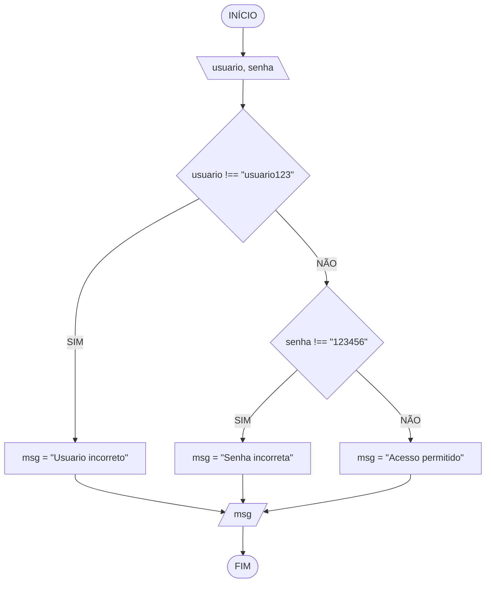

# Aula 4 - Exercício 3

## Descrição narrativa
1. Ler o nome de usuário e a senha.
2. Se o usuário estiver incorreto, guardar "Usuario incorreto" em `msg`.
3. Senão, se a senha estiver incorreta, guardar "Senha incorreta".
4. Caso contrário, guardar "Acesso permitido".
5. Mostrar `msg` uma única vez.

## Fluxograma

## Teste de mesa

| usuario    | senha  | msg               |
| ---------- | ------ | ----------------- |
| usuario123 | 123456 | Acesso permitido  |
| usuario123 | 999999 | Senha incorreta   |
| admin      | 123456 | Usuario incorreto |
| admin      | 999999 | Usuario incorreto |
