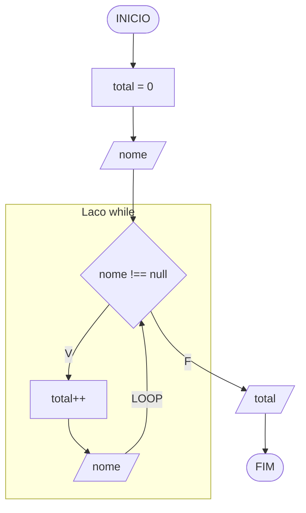
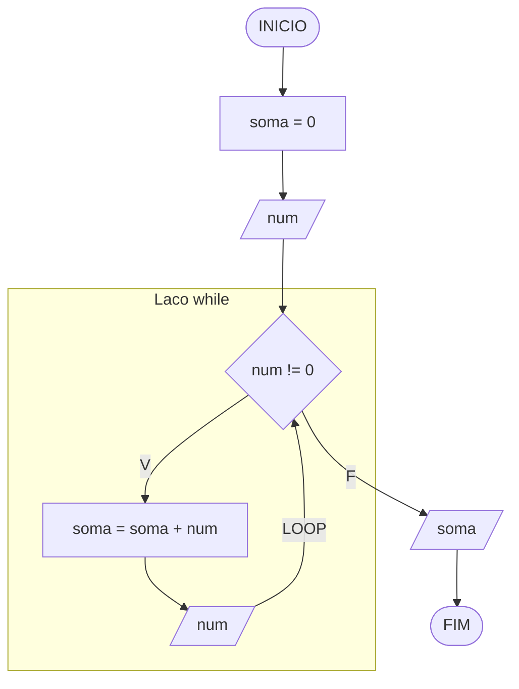
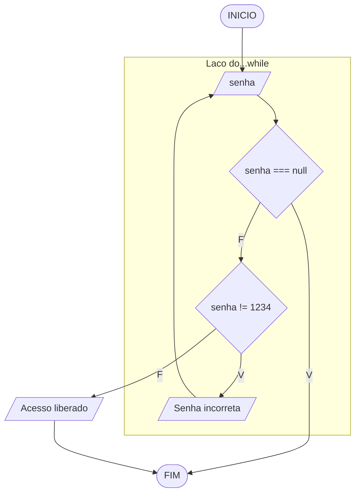
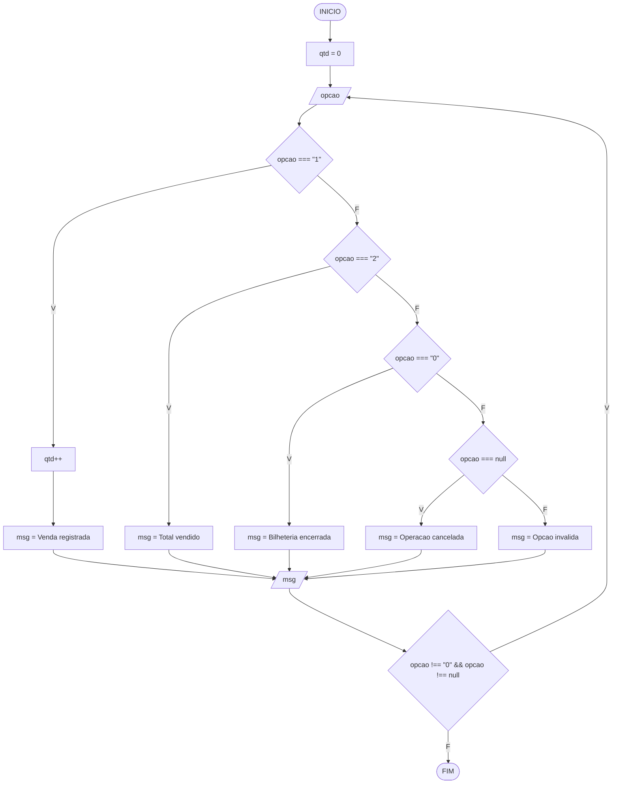
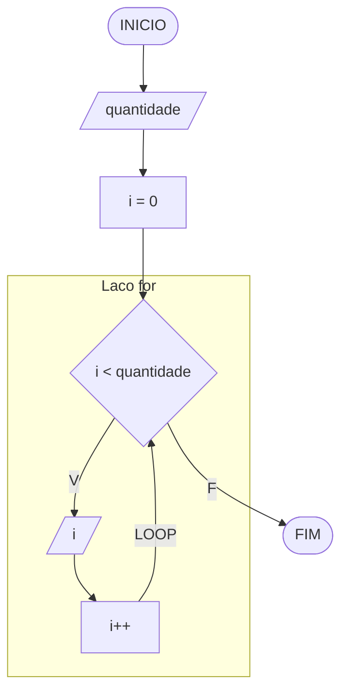
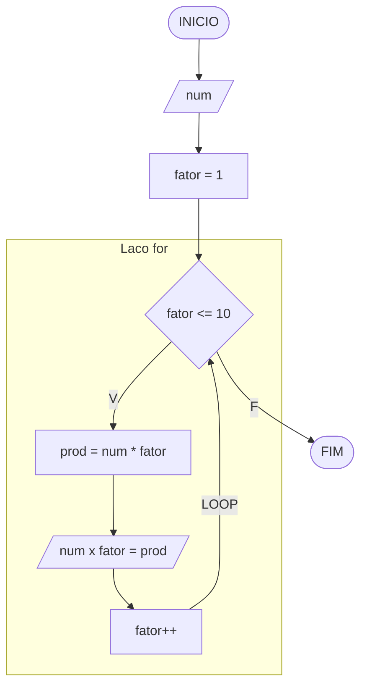
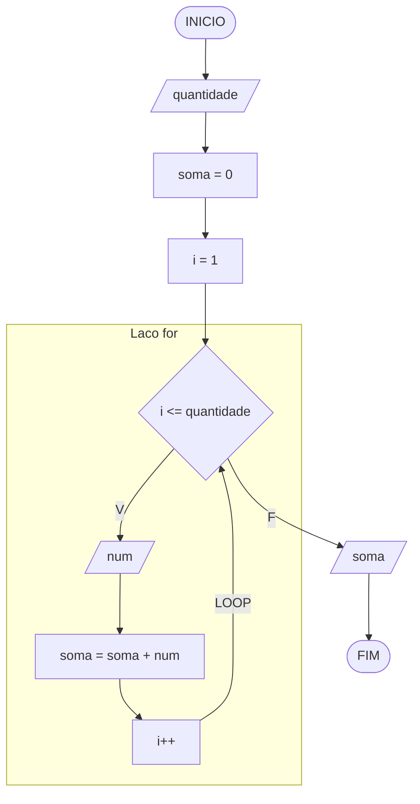

# Raciocínio Lógico Algorítmico: Aula 7
Orientador: Prof. Me Ricardo Carubbi

## Estruturas de repetição em TypeScript

### Objetivo da aula
Compreender quando usar `while`, `do...while` e `for`, representando algoritmos com descrição narrativa, fluxograma, teste de mesa e código TypeScript no Programiz.

## 1. Fundamentação teórica
Estruturas de repetição, também chamadas de laços ou loops, permitem executar um bloco de código várias vezes. Elas são usadas quando o algoritmo precisa repetir uma ação até que uma condição seja satisfeita ou durante uma quantidade conhecida de iterações.

Em TypeScript, os laços mais usados são:

- `while`: repete enquanto a condição for verdadeira. A verificação acontece antes da execução do bloco.
- `do...while`: executa o bloco pelo menos uma vez e só depois verifica a condição.
- `for`: é mais adequado quando a quantidade de repetições já é conhecida.

## 2. Como escolher o laço adequado
- Use `while` quando o número de repetições não é conhecido previamente.
- Use `do...while` quando o algoritmo precisa executar ao menos uma vez antes de decidir se repete.
- Use `for` quando existe contador, faixa de valores ou quantidade fixa de repetições.

## 3. Cancelamento de entrada dentro de um laço
Como estudado na Aula 6, `prompt()` retorna `string | null`. Quando uma nova
entrada é solicitada dentro de um laço, a condição de repetição também deve
considerar a possibilidade de cancelamento.

```typescript
while (numero <= 0 && entrada !== null) {
    entrada = prompt("Digite um numero positivo:");

    if (entrada !== null) {
        numero = parseInt(entrada);
    }
}
```

Sem a verificação de `null`, o algoritmo poderia tentar converter uma entrada
cancelada ou continuar repetindo sem receber um novo valor.

## 4. Sintaxe básica

### 3.1 Laço `while`
```typescript
while (condicao) {
    // bloco de repeticao
}
```

### 3.2 Laço `do...while`
```typescript
do {
    // bloco de repeticao
} while (condicao);
```

### 3.3 Laço `for`
```typescript
for (inicializacao; condicao; incremento) {
    // bloco de repeticao
}
```

## 5. Exemplos práticos

### Exemplo 1: `while` até cancelar a entrada

#### Descrição narrativa
1. Iniciar a contagem de nomes em zero.
2. Pedir um nome ao usuário.
3. Enquanto a entrada não for cancelada, contar o nome e pedir outro.
4. Mostrar quantos nomes foram informados.

O usuário pode cancelar já na primeira pergunta; nesse caso, o bloco do
`while` não será executado. A quantidade de repetições não é conhecida antes
da execução.

#### Fluxograma


#### Teste de mesa

| caso | nome recebido | nome !== null | total antes | total depois | saída |
| --- | --- | --- | --- | --- | --- |
| zero nomes | `null` | F | 0 | 0 | Nomes informados: 0 |
| um nome | `Ana` | V | 0 | 1 | - |
| um nome | `null` | F | 1 | 1 | Nomes informados: 1 |
| três nomes | `Ana` | V | 0 | 1 | - |
| três nomes | `Bia` | V | 1 | 2 | - |
| três nomes | `Caio` | V | 2 | 3 | - |
| três nomes | `null` | F | 3 | 3 | Nomes informados: 3 |

#### Código TypeScript (Programiz)
```typescript
let nome: string | null;
let total: number;

total = 0;
nome = prompt("Digite um nome (Cancelar para encerrar):");

while (nome !== null) {
    total++;
    nome = prompt("Digite um nome (Cancelar para encerrar):");
}

console.log(`Nomes informados: ${total}`);
```

### Exemplo 2: `while` para pedir números até digitar 0

#### Descrição narrativa
1. Ler um número.
2. Enquanto o número for diferente de zero, somá-lo ao acumulador.
3. Pedir um novo número.
4. Quando o usuário digitar zero ou cancelar a entrada, mostrar a soma acumulada.

#### Fluxograma


#### Teste de mesa

| passo | num | num != 0 | soma antes | soma depois | saída |
| --- | --- | --- | --- | --- | --- |
| 1 | 5 | V | 0 | 5 | - |
| 2 | 3 | V | 5 | 8 | - |
| 3 | 2 | V | 8 | 10 | - |
| 4 | 0 | F | 10 | 10 | 10 |

Se a entrada for cancelada após `5` e `3`, o laço termina e a soma
acumulada `8` é mostrada. Se o cancelamento ocorrer na primeira pergunta,
nenhuma soma é mostrada.

#### Código TypeScript (Programiz)
```typescript
// Declaracao de variaveis
let entradaNumero: string | null;
let num: number;
let soma: number;

// Entrada
entradaNumero = prompt("Digite um numero (0 para encerrar):"); // 5

// Processamento
if (entradaNumero !== null) {
    num = parseInt(entradaNumero);
    soma = 0;

    // Verifica null novamente: a nova leitura pode ser cancelada.
    while (num !== 0 && entradaNumero !== null) {
        soma += num;
        entradaNumero = prompt("Digite um numero (0 para encerrar):"); // 3, 2, 0

        if (entradaNumero !== null) {
            num = parseInt(entradaNumero);
        }
    }

    // Saida
    console.log(soma);
}
```

### Exemplo 3: `do...while` para pedir uma senha

#### Descrição narrativa
1. Ler uma senha.
2. Executar o teste ao menos uma vez.
3. Se a senha estiver incorreta, informar erro.
4. Repetir até que a senha correta seja digitada ou a entrada seja cancelada.
5. Mostrar a mensagem de acesso liberado somente se a senha estiver correta.

#### Fluxograma


#### Teste de mesa

| passo | senha | senha != 1234 | saída |
| --- | --- | --- | --- |
| 1 | 1111 | V | Senha incorreta |
| 2 | 9999 | V | Senha incorreta |
| 3 | 1234 | F | Acesso liberado |

Se a entrada for cancelada, o laço termina sem mostrar "Senha incorreta"
nem "Acesso liberado".

#### Código TypeScript (Programiz)
```typescript
// Declaracao de variaveis
let senha: string | null;

// Processamento e saida
do {
    senha = prompt("Digite a senha:"); // 1111, 9999, 1234

    if (senha !== "1234" && senha !== null) {
        console.log("Senha incorreta");
    }
} while (senha !== "1234" && senha !== null);

// O laço também termina ao cancelar; só libera o acesso com a senha correta.
if (senha === "1234") {
    console.log("Acesso liberado");
}
```


### Exemplo 4: `do...while` em uma bilheteria

#### Descrição narrativa
1. Iniciar em zero a quantidade de ingressos vendidos.
2. Mostrar o menu: vender um ingresso, consultar o total ou sair.
3. Executar a opção escolhida e mostrar uma mensagem.
4. Repetir até escolher sair ou cancelar a entrada.

O menu aparece ao menos uma vez. A quantidade de ingressos permanece entre as
repetições.

#### Fluxograma


#### Teste de mesa

| passo | opcao | qtd antes | qtd depois | msg e saída | repete? |
| --- | --- | --- | --- | --- | --- |
| 1 | 1 | 0 | 1 | Venda registrada. Total: 1 | Sim |
| 2 | 1 | 1 | 2 | Venda registrada. Total: 2 | Sim |
| 3 | 2 | 2 | 2 | Ingressos vendidos: 2 | Sim |
| 4 | 0 | 2 | 2 | Bilheteria encerrada. Total: 2 | Não |

Se a primeira entrada for cancelada, `qtd` permanece em `0`, a saída é
"Operação cancelada" e o laço termina.

#### Código TypeScript (Programiz)
```typescript
let opcao: string | null;
let qtd: number;
let msg: string;

qtd = 0;

do {
    opcao = prompt("Bilheteria: 1 vender, 2 consultar, 0 sair");

    if (opcao === "1") {
        qtd++;
        msg = `Venda registrada. Total: ${qtd}`;
    } else if (opcao === "2") {
        msg = `Ingressos vendidos: ${qtd}`;
    } else if (opcao === "0") {
        msg = `Bilheteria encerrada. Total: ${qtd}`;
    } else if (opcao === null) {
        msg = "Operação cancelada";
    } else {
        msg = "Opção inválida";
    }

    console.log(msg);
} while (opcao !== "0" && opcao !== null);
```

### Exemplo 5: `for` básico com contador

#### Descrição narrativa
1. Ler a quantidade de iteracoes.
2. Declarar um contador iniciando em zero.
3. Repetir enquanto o contador for menor que a quantidade informada.
4. Mostrar o valor do contador.
5. Incrementar o contador a cada repetição.

#### Fluxograma


#### Teste de mesa

Entrada escolhida: `quantidade = 3`

| passo | i | i < quantidade | saída |
| --- | --- | --- | --- |
| 1 | 0 | V | 0 |
| 2 | 1 | V | 1 |
| 3 | 2 | V | 2 |
| 4 | 3 | F | - |

#### Código TypeScript (Programiz)
```typescript
// Declaracao de variaveis
let entradaQuantidade: string | null;
let i: number;
let quantidade: number;

// Entrada
entradaQuantidade = prompt("Digite a quantidade de iteracoes:"); // 3

// Processamento
if (entradaQuantidade !== null) {
    quantidade = parseInt(entradaQuantidade);

    for (i = 0; i < quantidade; i++) {
        console.log(i);
    }
}
```

### Exemplo 6: `for` para gerar a tabuada

#### Descrição narrativa
1. Ler um número.
2. Repetir de 1 até 10.
3. Calcular o produto do número pelo fator atual.
4. Mostrar a tabuada completa.

#### Fluxograma


#### Teste de mesa

Entrada escolhida: `num = 4`

| passo | fator | fator <= 10 | prod | saída |
| --- | --- | --- | --- | --- |
| 1 | 1 | V | 4 | 4 x 1 = 4 |
| 2 | 2 | V | 8 | 4 x 1 = 4 / 4 x 2 = 8 |
| 3 | 3 | V | 12 | 4 x 1 = 4 / 4 x 2 = 8 / 4 x 3 = 12 |
| ... | ... | ... | ... | ... |
| 10 | 10 | V | 40 | ... / 4 x 10 = 40 |
| 11 | 11 | F | - | tabuada completa |

#### Código TypeScript (Programiz)
```typescript
// Declaracao de variaveis
let entradaNumero: string | null;
let num: number;
let fator: number;
let prod: number;
let tabuada: string;

// Entrada
entradaNumero = prompt("Digite o numero da tabuada:"); // 4

// Processamento
if (entradaNumero !== null) {
    num = parseInt(entradaNumero);
    tabuada = "";

    for (fator = 1; fator <= 10; fator++) {
        prod = num * fator;
        tabuada += `${num} x ${fator} = ${prod}\n`;
    }

    // Saida
    console.log(tabuada);
}
```

### Exemplo 7: `for` para somar n números

#### Descrição narrativa
1. Ler quantos números serão somados.
2. Repetir a leitura dessa quantidade de números.
3. Somar cada valor ao acumulador.
4. Mostrar a soma acumulada, inclusive se uma leitura for cancelada.

#### Fluxograma


#### Teste de mesa

Entrada escolhida: `quantidade = 3`

| passo | i | i <= quantidade | num | soma antes | soma depois | saída |
| --- | --- | --- | --- | --- | --- | --- |
| 1 | 1 | V | 10 | 0 | 10 | - |
| 2 | 2 | V | 20 | 10 | 30 | - |
| 3 | 3 | V | 5 | 30 | 35 | - |
| 4 | 4 | F | - | 35 | 35 | 35 |

Se a leitura de um número for cancelada, o laço termina e mostra a soma
dos números informados até então.

#### Código TypeScript (Programiz)
```typescript
// Declaracao de variaveis
let entradaQuantidade: string | null;
let entradaNumero: string | null;
let quantidade: number;
let i: number;
let num: number;
let soma: number;

// Entrada
entradaQuantidade = prompt("Digite quantos numeros deseja somar:"); // 3

// Processamento
if (entradaQuantidade !== null) {
    quantidade = parseInt(entradaQuantidade);
    entradaNumero = "";
    soma = 0;

    for (i = 1; i <= quantidade && entradaNumero !== null; i++) {
        entradaNumero = prompt(`Digite o ${i}o numero:`); // 10, 20, 5

        if (entradaNumero !== null) {
            num = parseInt(entradaNumero);
            soma += num;
        }
    }

    // Saida
    console.log(soma);
}
```

## 6. Comparativo final

| Estrutura | Quando usar | Exemplo desta aula |
| --- | --- | --- |
| `while` | quando nao sabemos quantas repeticoes vao acontecer | nomes até cancelar, soma ate digitar 0 |
| `do...while` | quando o bloco precisa executar ao menos uma vez | senha, menu |
| `for` | quando existe contagem conhecida | contador basico, tabuada, soma de n numeros |

## 7. Fechamento
Nesta aula, vimos que a escolha da estrutura de repetição depende do problema. O mais importante não é decorar sintaxe, mas perceber se o algoritmo depende de uma condição aberta, de uma execução mínima obrigatória ou de uma quantidade conhecida de repetições.

## Referências bibliográficas
1. MOZILLA DEVELOPER NETWORK. `while`. Disponível em: https://developer.mozilla.org/pt-BR/docs/Web/JavaScript/Reference/Statements/while.
2. MOZILLA DEVELOPER NETWORK. `do...while`. Disponível em: https://developer.mozilla.org/pt-BR/docs/Web/JavaScript/Reference/Statements/do...while.
3. MOZILLA DEVELOPER NETWORK. `for`. Disponível em: https://developer.mozilla.org/pt-BR/docs/Web/JavaScript/Reference/Statements/for.
