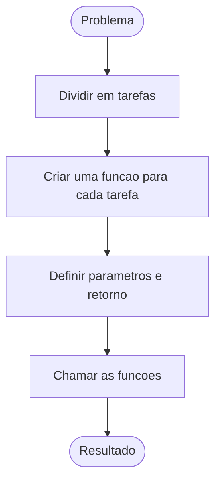

# Raciocínio Lógico Algorítmico: Aula 8
Orientador: Prof. Me Ricardo Carubbi

## Funções e algoritmos clássicos

### Objetivo da aula
Compreender como criar e reutilizar funções em TypeScript, declarando
explicitamente os tipos dos parâmetros e do retorno. Aplicar essa organização
em algoritmos de soma, troca de valores, fatorial, Fibonacci, conversão de base
e geração de números primos.

## 1. Fundamentação teórica
Uma função é um bloco de código criado para executar uma tarefa específica.
Ela ajuda a:

- dividir um problema maior em partes menores;
- evitar a repetição de código;
- dar nomes claros às etapas do algoritmo;
- facilitar testes e correções;
- reutilizar uma solução com valores diferentes.



Nesta disciplina, usaremos inicialmente a declaração tradicional com
`function`, pois ela deixa explícitos o nome, os parâmetros e o retorno.

## 2. Parâmetros e retorno em TypeScript
Em TypeScript, cada parâmetro deve ter seu tipo indicado após `:`. O tipo do
retorno é escrito depois dos parênteses.

```typescript
/** Soma dois números. */
function somar(a: number, b: number): number {
    // Declaração de variáveis locais
    let res: number;

    res = a + b;
    return res;
}
```

Na declaração acima:

- `a: number` e `b: number` são parâmetros numéricos;
- `: number` depois dos parênteses indica o tipo retornado;
- `return` encerra a função e devolve o resultado.

Quando uma função apenas executa uma ação e não devolve um valor, seu retorno
é `void`.

```typescript
/** Exibe um número no console. */
function exibirResultado(valor: number): void {
    console.log(valor);
}
```

O tipo `void` não representa uma variável sem tipo. Ele informa que a função
não entrega um resultado por meio de `return`.

## 3. Exemplo básico: soma

```typescript
/** Soma dois números. */
function somar(a: number, b: number): number {
    return a + b;
}

// Declaração de variáveis globais
let entNum1: string | null;
let entNum2: string | null;
let num1: number;
let num2: number;
let total: number;

// Entrada
entNum1 = prompt("Digite o primeiro numero:");
entNum2 = prompt("Digite o segundo numero:");

// Processamento
if (entNum1 !== null && entNum2 !== null) {
    num1 = parseFloat(entNum1);
    num2 = parseFloat(entNum2);
    total = somar(num1, num2);

    // Saida
    console.log(total);
}
```

A conversão da entrada acontece fora da função. Assim, `somar` recebe números
e realiza somente a tarefa indicada por seu nome.

## 4. Escopo de variáveis
Uma variável declarada dentro de uma função possui escopo local. Ela só pode
ser usada naquele bloco. Nos exemplos desta aula, as variáveis declaradas fora
das funções são chamadas de globais: pertencem ao programa principal. Uma
função pode acessá-las, mas recebe por parâmetros os valores de que precisa
para executar sua tarefa.

```typescript
/** Exibe uma saudação para o nome informado. */
function mostrarMensagem(nome: string): void {
    // Declaração de variáveis locais
    let saudacao: string;

    saudacao = "Ola, " + nome;
    console.log(saudacao);
}

// Declaração de variáveis globais
let aluno: string | null;

// Entrada
aluno = prompt("Digite o nome do aluno:");

if (aluno !== null) {
    mostrarMensagem(aluno);
    console.log(aluno);
}
```

Nesse exemplo, `saudacao` é local à função e `aluno` é global. A função recebe
uma cópia do valor de `aluno` por meio do parâmetro `nome`.

## 5. Reutilização de código
Uma mesma função pode ser chamada várias vezes.

```typescript
/** Calcula o dobro de um número. */
function calcularDobro(num: number): number {
    return num * 2;
}

console.log(calcularDobro(5));
console.log(calcularDobro(8));
console.log(calcularDobro(12));
```

Uma função também pode possuir mais de um `return`, desde que todos os caminhos
respeitem o tipo declarado.

```typescript
/** Determina a situação do aluno pela média. */
function situacaoAluno(media: number): string {
    if (media >= 7) {
        return "Aprovado";
    }

    if (media >= 5) {
        return "Recuperacao";
    }

    return "Reprovado";
}
```

## 6. Modularização
Cada função deve ter um objetivo bem definido. No BEE1002, a função recebe o
raio e calcula a área do círculo. O programa principal lê e converte a entrada,
chama a função e mostra o resultado.

```typescript
// Declarar as variáveis globais
let entRaio: string | null;
let raio: number;
let area: number;

/** Calcula a área do círculo a partir do raio. */
function calcularAreaCirculo(raio: number): number {
    // Declarar as variáveis locais
    let res: number;

    res = 3.14159 * raio * raio;
    return res;
}

// Entrada de dados
entRaio = prompt('Digite o raio: ');

// Processamento dos dados
if (entRaio !== null) {
    raio = parseFloat(entRaio);
    area = calcularAreaCirculo(raio);

    // Saída de dados
    console.log(`A=${area.toFixed(4)}`);
}
```

Compare com a [solução sem função](../../exercicios/BEE1002.ts) e consulte a
[versão com função](../../exercicios/BEE1002_funcao.ts).

## 7. Troca de valores
A função abaixo troca os valores de `a` e `b`. A leitura e a saída continuam
no programa principal.

```typescript
// Declaração de variáveis globais
let entA: string | null;
let entB: string | null;
let a: number;
let b: number;

/** Troca os valores globais de a e b. */
function trocarValores(): void {
    // Declaração de variáveis locais
    let temp: number;

    temp = a;
    a = b;
    b = temp;
}

// Entrada
entA = prompt("Digite o valor de a:");
entB = prompt("Digite o valor de b:");

// Processamento
if (entA !== null && entB !== null) {
    a = parseFloat(entA);
    b = parseFloat(entB);

    trocarValores();

    // Saida
    console.log(a);
    console.log(b);
}
```

`trocarValores` altera as variáveis globais `a` e `b`; por isso, depende delas
e não recebe parâmetros. Se recebesse dois números como parâmetros, trocaria
apenas as cópias locais, sem alterar os valores do programa principal. Uma
função que devolva os dois valores poderá ser estudada após a introdução de
vetores na Aula 9.

## 8. Funções escalares para contagem, soma e produto
Quando cada função devolve um único número, seus retornos podem permanecer
simples e explícitos.

```typescript
/** Conta de 1 até n. */
function calcularContagem(n: number): number {
    // Declaração de variáveis locais
    let cont: number;
    let i: number;

    cont = 0;

    for (i = 1; i <= n; i++) {
        cont++;
    }

    return cont;
}

/** Soma os inteiros de 1 até n. */
function calcularSoma(n: number): number {
    // Declaração de variáveis locais
    let soma: number;
    let i: number;

    soma = 0;

    for (i = 1; i <= n; i++) {
        soma += i;
    }

    return soma;
}

/** Multiplica os inteiros de 1 até n. */
function calcularProduto(n: number): number {
    // Declaração de variáveis locais
    let prod: number;
    let i: number;

    prod = 1;

    for (i = 1; i <= n; i++) {
        prod *= i;
    }

    return prod;
}
```

## 9. Fatorial
O fatorial de um número inteiro não negativo `n` é o produto dos números de
`1` até `n`. Por definição, o fatorial de zero é `1`.

```typescript
/** Calcula o fatorial de n. */
function calcularFatorial(n: number): number {
    // Declaração de variáveis locais
    let fat: number;
    let i: number;

    fat = 1;

    for (i = 1; i <= n; i++) {
        fat *= i;
    }

    return fat;
}

// Declaração de variáveis globais
let entNum: string | null;
let num: number;

// Entrada
entNum = prompt("Digite um numero:");

if (entNum !== null) {
    num = parseInt(entNum);
    console.log(calcularFatorial(num));
}
```

O exemplo `aula8_10.ts`, inspirado no Beecrowd 1153, usa o mesmo padrão de
entrada compatível com os compiladores online adotados na disciplina.

## 10. Sequência de Fibonacci
Na sequência de Fibonacci, cada termo é obtido pela soma dos dois anteriores.

```typescript
/** Gera os primeiros termos da sequência de Fibonacci. */
function gerarFibonacci(qtd: number): string {
    // Declaração de variáveis locais
    let a: number;
    let b: number;
    let prox: number;
    let i: number;
    let seq: string;

    a = 0;
    b = 1;
    seq = "";

    for (i = 1; i <= qtd; i++) {
        seq += a;

        if (i < qtd) {
            seq += ", ";
        }

        prox = a + b;
        a = b;
        b = prox;
    }

    return seq;
}
```

A função devolve uma `string` pronta para exibição. O armazenamento de vários
valores será apresentado na próxima aula.

## 11. Conversão de decimal para binário
Para converter um inteiro decimal positivo em binário:

1. calcule o resto da divisão por `2`;
2. coloque o resto antes dos anteriores;
3. divida o número por `2`, descartando a parte decimal;
4. repita até o número chegar a zero.

```typescript
/** Converte um inteiro decimal para binário. */
function decimalParaBinario(num: number): string {
    // Declaração de variáveis locais
    let bin: string;
    let resto: number;

    if (num === 0) {
        return "0";
    }

    bin = "";

    while (num > 0) {
        resto = num % 2;
        bin = resto + bin;
        num = Math.trunc(num / 2);
    }

    return bin;
}
```

Teste de mesa para `num = 13`:

| num | resto | bin |
| --- | --- | --- |
| 13 | 1 | 1 |
| 6 | 0 | 01 |
| 3 | 1 | 101 |
| 1 | 1 | 1101 |

## 12. Geração dos primeiros números primos
Um número primo é maior ou igual a `2` e possui apenas dois divisores
positivos: `1` e ele mesmo.

```typescript
/** Verifica se um número é primo. */
function ehPrimo(num: number): boolean {
    // Declaração de variáveis locais
    let div: number;

    if (num < 2) {
        return false;
    }

    for (div = 2; div < num; div++) {
        if (num % div === 0) {
            return false;
        }
    }

    return true;
}

/** Gera a quantidade informada de números primos. */
function gerarNPrimeirosPrimos(qtd: number): string {
    // Declaração de variáveis locais
    let cont: number;
    let cand: number;
    let resp: string;

    cont = 0;
    cand = 2;
    resp = "";

    while (cont < qtd) {
        if (ehPrimo(cand)) {
            if (cont > 0) {
                resp += ", ";
            }

            resp += cand;
            cont++;
        }

        cand++;
    }

    return resp;
}
```

Separar `ehPrimo` de `gerarNPrimeirosPrimos` permite testar cada regra de forma
independente.

## 13. Tipos de retorno usados nesta aula

| Retorno | Uso |
| --- | --- |
| `number` | cálculos como soma, dobro e fatorial |
| `string` | mensagens e sequências formatadas |
| `boolean` | respostas lógicas, como verificar se um número é primo |
| `void` | funções que executam uma ação sem devolver valor |

## 14. Erros comuns

- omitir o tipo de um parâmetro;
- converter a mesma entrada repetidamente dentro de uma função;
- declarar `void` em uma função que precisa devolver um resultado;
- esquecer de retornar um valor em algum caminho;
- chamar a função com um argumento de tipo incompatível;
- acessar dentro da função uma variável que deveria ser um parâmetro;
- usar uma estrutura de vários elementos antes de ela ser estudada.

## 15. Padrão de estilo adotado
Para aproximar a progressão da linguagem Java:

- declarar variáveis no início do bloco;
- indicar explicitamente o tipo;
- inicializar depois da declaração;
- usar abreviações claras para nomes recorrentes, como `num`, `qtd`, `fat` e `prox`;
- separar entrada, processamento e saída;
- usar uma instrução por linha;
- manter blocos delimitados por chaves;
- escrever funções com um objetivo bem definido;
- preferir lógica explícita nas primeiras aulas.

```typescript
/** Calcula o dobro de um número. */
function calcularDobro(num: number): number {
    // Declaração de variáveis locais
    let dobro: number;

    dobro = num * 2;
    return dobro;
}
```

## 16. Fechamento
Nesta aula, aprendemos a:

1. declarar tipos nos parâmetros e retornos;
2. usar `void` em funções sem valor de retorno;
3. separar entrada textual de valores numéricos;
4. modularizar problemas com funções pequenas;
5. aplicar funções em algoritmos clássicos;
6. manter as entradas compatíveis com compiladores online.

Na Aula 9, funções poderão receber e devolver vetores tipados.

## Saiba mais
- TypeScript Handbook - Functions: https://www.typescriptlang.org/docs/handbook/2/functions.html
- MDN - Functions: https://developer.mozilla.org/pt-BR/docs/Web/JavaScript/Guide/Functions
- MDN - return: https://developer.mozilla.org/pt-BR/docs/Web/JavaScript/Reference/Statements/return
