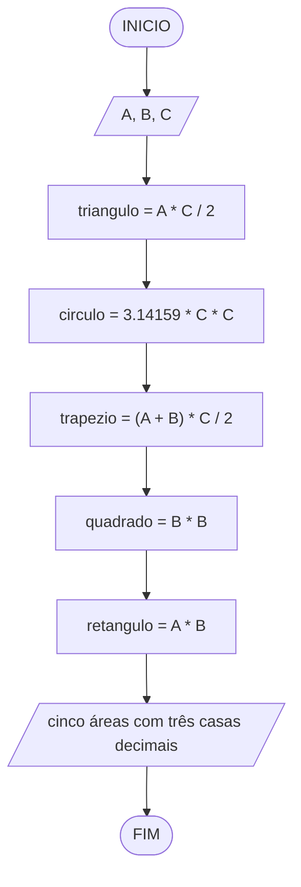

# BEE1012 - Área

## Fluxograma

```mermaid
flowchart TD
A([INICIO]) --> B[/"A, B, C"/]
B --> C["triangulo = A * C / 2"]
C --> D["circulo = 3.14159 * C * C"]
D --> E["trapezio = (A + B) * C / 2"]
E --> F["quadrado = B * B"]
F --> G["retangulo = A * B"]
G --> H[/"cinco áreas com três casas decimais"/]
H --> I([FIM])
```
