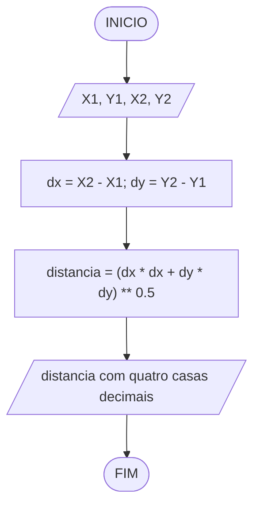

# BEE1015 - Distância Entre Dois Pontos

## Fluxograma

```mermaid
flowchart TD
A([INICIO]) --> B[/"X1, Y1, X2, Y2"/]
B --> C["dx = X2 - X1; dy = Y2 - Y1"]
C --> D["distancia = (dx * dx + dy * dy) ** 0.5"]
D --> E[/"distancia com quatro casas decimais"/]
E --> F([FIM])
```
