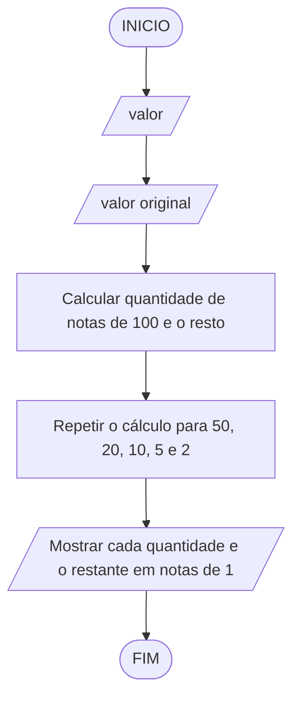

# BEE1018 - Cédulas

Solução sequencial adequada à Aula 2. A mesma divisão com resto é aplicada a cada valor de cédula, sem vetor ou laço.

## Fluxograma

```mermaid
flowchart TD
A([INICIO]) --> B[/"valor"/]
B --> C[/"valor original"/]
C --> D["Calcular quantidade de notas de 100 e o resto"]
D --> E["Repetir o cálculo para 50, 20, 10, 5 e 2"]
E --> F[/"Mostrar cada quantidade e o restante em notas de 1"/]
F --> G([FIM])
```
