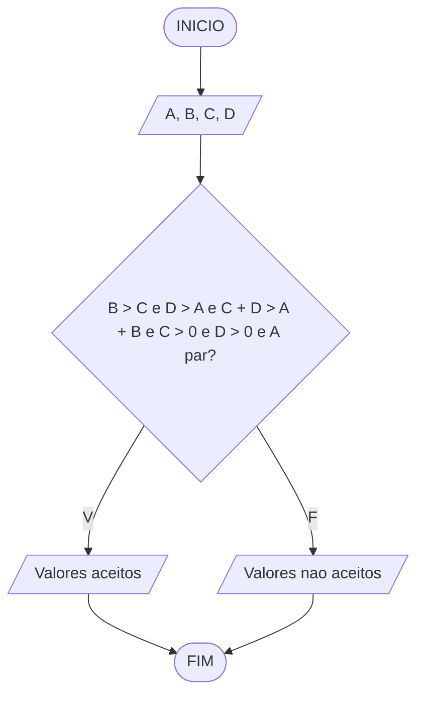

# BEE1035 - Teste de Seleção 1

## Fluxograma

```mermaid
flowchart TD
A([INICIO]) --> B[/"A, B, C, D"/]
B --> C{"B > C e D > A e C + D > A + B e C > 0 e D > 0 e A par?"}
C -- V --> D[/"Valores aceitos"/]
C -- F --> E[/"Valores nao aceitos"/]
D --> F([FIM])
E --> F
```
