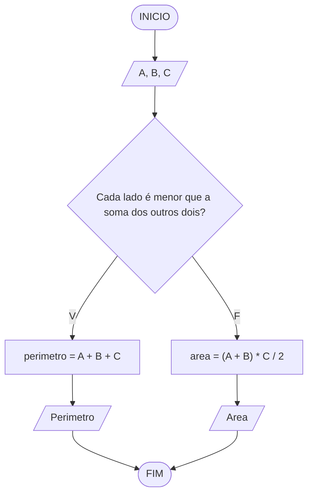

# BEE1043 - Triângulo

## Fluxograma

```mermaid
flowchart TD
A([INICIO]) --> B[/"A, B, C"/]
B --> C{"Cada lado é menor que a soma dos outros dois?"}
C -- V --> D["perimetro = A + B + C"]
C -- F --> E["area = (A + B) * C / 2"]
D --> F[/"Perimetro"/]
E --> G[/"Area"/]
F --> H([FIM])
G --> H
```
