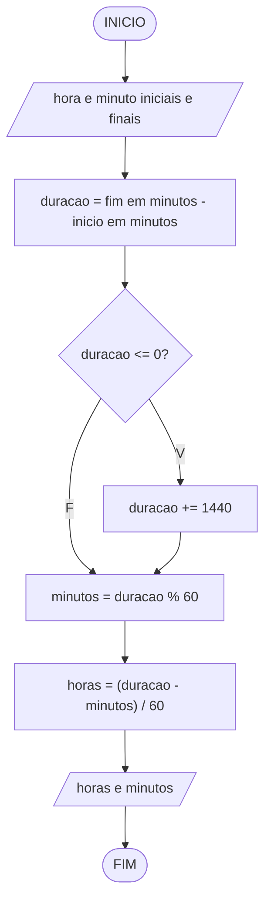

# BEE1047 - Tempo de Jogo com Minutos

## Fluxograma

```mermaid
flowchart TD
A([INICIO]) --> B[/"hora e minuto iniciais e finais"/]
B --> C["duracao = fim em minutos - inicio em minutos"]
C --> D{"duracao <= 0?"}
D -- V --> E["duracao += 1440"]
D -- F --> F["minutos = duracao % 60"]
E --> F
F --> G["horas = (duracao - minutos) / 60"]
G --> H[/"horas e minutos"/]
H --> I([FIM])
```
