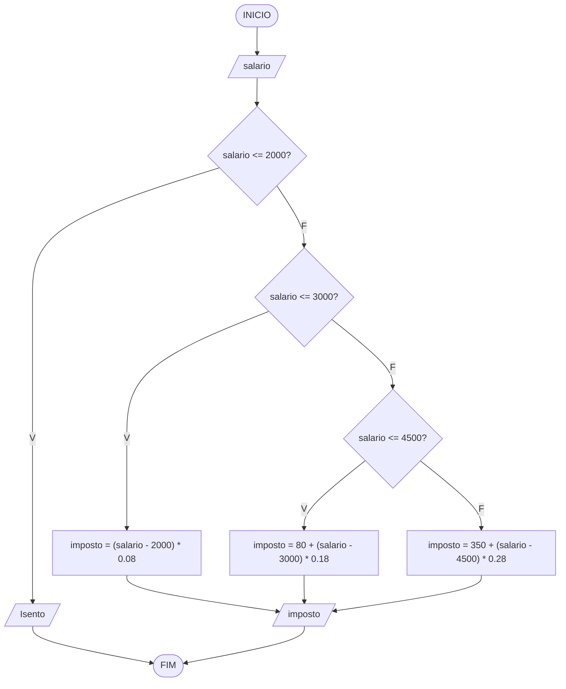

# BEE1051 - Impostos

## Fluxograma

```mermaid
flowchart TD
A([INICIO]) --> B[/"salario"/]
B --> C{"salario <= 2000?"}
C -- V --> D[/"Isento"/]
C -- F --> E{"salario <= 3000?"}
E -- V --> F["imposto = (salario - 2000) * 0.08"]
E -- F --> G{"salario <= 4500?"}
G -- V --> H["imposto = 80 + (salario - 3000) * 0.18"]
G -- F --> I["imposto = 350 + (salario - 4500) * 0.28"]
F --> J[/"imposto"/]
H --> J
I --> J
D --> K([FIM])
J --> K
```
