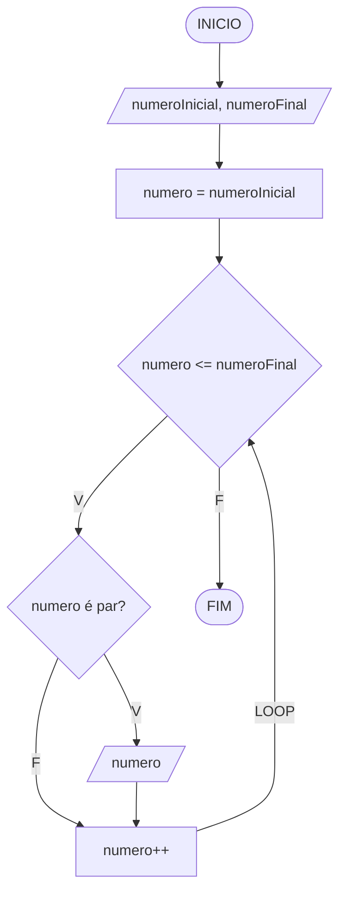

# BEE1059 - Números Pares

Peça os números inicial e final e imprima os pares do intervalo, incluindo os limites quando forem pares, um por linha. Para reproduzir o enunciado original do beecrowd, informe 1 e 100.

## Fluxograma com `while`

Solução ativa em [BEE1059.ts](BEE1059.ts).

## Fluxograma com `for`

Solução comentada no mesmo arquivo. Para executá-la, comente o bloco com `while` e descomente o bloco com `for`.

As duas soluções produzem a mesma saída. Em ambas, o `if` verifica cada número do intervalo antes de imprimi-lo. No `while`, o incremento fica no corpo do laço; no `for`, fica no cabeçalho.
