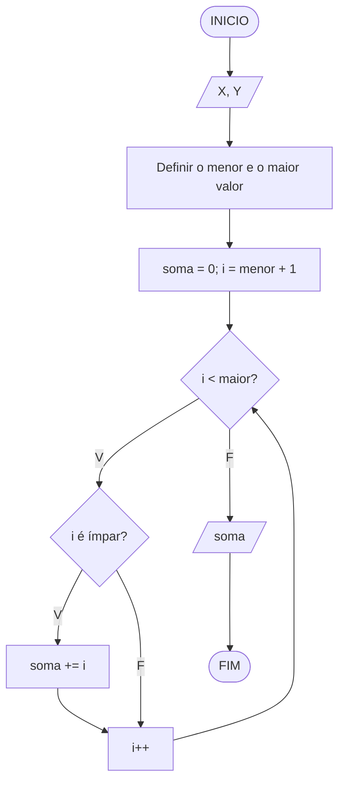

# BEE1071 - Soma de Ímpares Consecutivos I

## Fluxograma

```mermaid
flowchart TD
A([INICIO]) --> B[/"X, Y"/]
B --> C["Definir o menor e o maior valor"]
C --> D["soma = 0; i = menor + 1"]
D --> E{"i < maior?"}
E -- V --> F{"i é ímpar?"}
F -- V --> G["soma += i"]
F -- F --> H["i++"]
G --> H
H --> E
E -- F --> I[/"soma"/]
I --> J([FIM])
```
