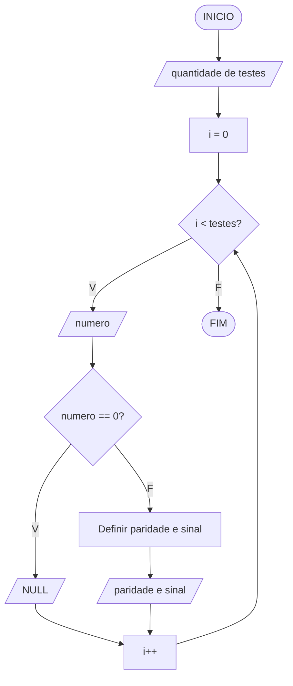

# BEE1074 - Par ou Ímpar

## Fluxograma

```mermaid
flowchart TD
A([INICIO]) --> B[/"quantidade de testes"/]
B --> C["i = 0"]
C --> D{"i < testes?"}
D -- V --> E[/"numero"/]
E --> F{"numero == 0?"}
F -- V --> G[/"NULL"/]
F -- F --> H["Definir paridade e sinal"]
H --> I[/"paridade e sinal"/]
G --> J["i++"]
I --> J
J --> D
D -- F --> K([FIM])
```
