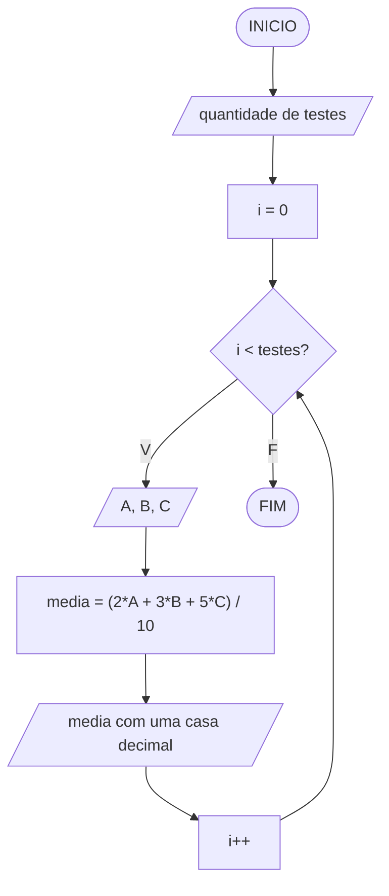

# BEE1079 - Médias Ponderadas

## Fluxograma

```mermaid
flowchart TD
A([INICIO]) --> B[/"quantidade de testes"/]
B --> C["i = 0"]
C --> D{"i < testes?"}
D -- V --> E[/"A, B, C"/]
E --> F["media = (2*A + 3*B + 5*C) / 10"]
F --> G[/"media com uma casa decimal"/]
G --> H["i++"]
H --> D
D -- F --> I([FIM])
```
