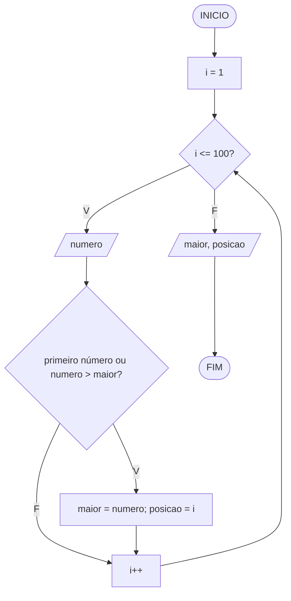

# BEE1080 - Maior e Posição

## Fluxograma

```mermaid
flowchart TD
A([INICIO]) --> B["i = 1"]
B --> C{"i <= 100?"}
C -- V --> D[/"numero"/]
D --> E{"primeiro número ou numero > maior?"}
E -- V --> F["maior = numero; posicao = i"]
E -- F --> G["i++"]
F --> G
G --> C
C -- F --> H[/"maior, posicao"/]
H --> I([FIM])
```
