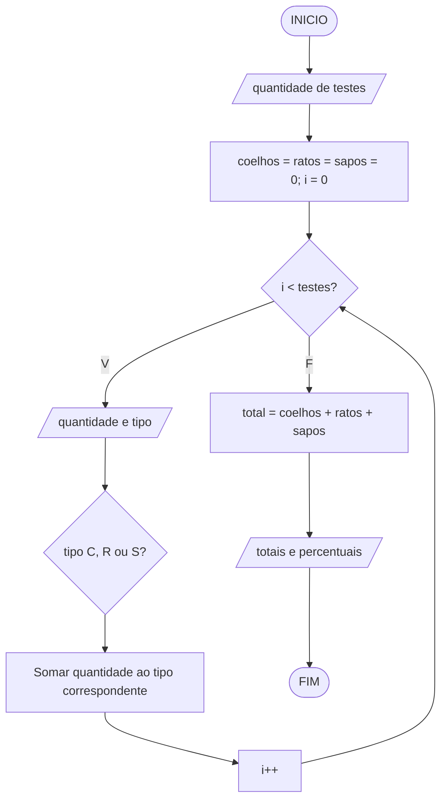

# BEE1094 - Experiências

## Fluxograma

```mermaid
flowchart TD
A([INICIO]) --> B[/"quantidade de testes"/]
B --> C["coelhos = ratos = sapos = 0; i = 0"]
C --> D{"i < testes?"}
D -- V --> E[/"quantidade e tipo"/]
E --> F{"tipo C, R ou S?"}
F --> G["Somar quantidade ao tipo correspondente"]
G --> H["i++"]
H --> D
D -- F --> I["total = coelhos + ratos + sapos"]
I --> J[/"totais e percentuais"/]
J --> K([FIM])
```
