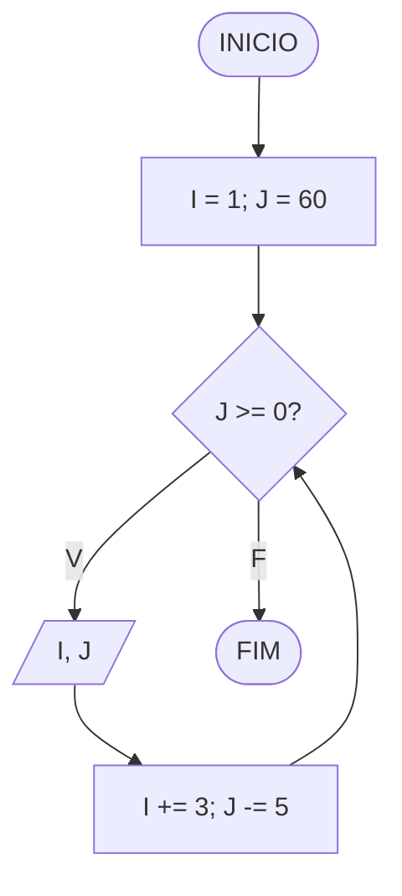

# BEE1095 - Sequência IJ 1

## Fluxograma

```mermaid
flowchart TD
A([INICIO]) --> B["I = 1; J = 60"]
B --> C{"J >= 0?"}
C -- V --> D[/"I, J"/]
D --> E["I += 3; J -= 5"]
E --> C
C -- F --> F([FIM])
```
