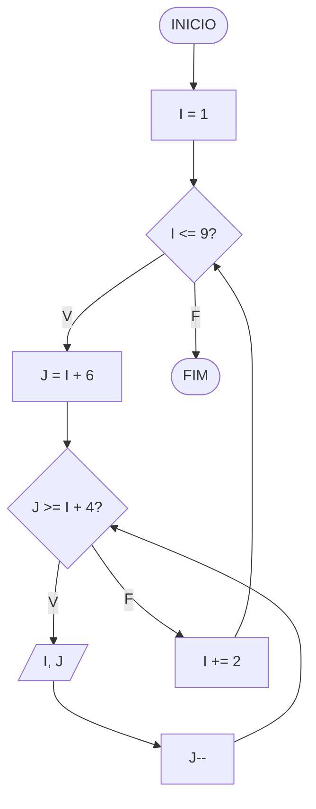

# BEE1097 - Sequência IJ 3

## Fluxograma

```mermaid
flowchart TD
A([INICIO]) --> B["I = 1"]
B --> C{"I <= 9?"}
C -- V --> D["J = I + 6"]
D --> E{"J >= I + 4?"}
E -- V --> F[/"I, J"/]
F --> G["J--"]
G --> E
E -- F --> H["I += 2"]
H --> C
C -- F --> I([FIM])
```
