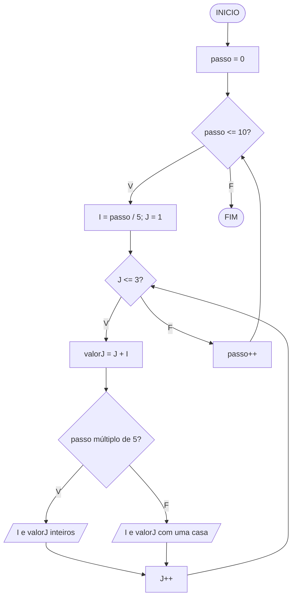

# BEE1098 - Sequência IJ 4

## Fluxograma

```mermaid
flowchart TD
A([INICIO]) --> B["passo = 0"]
B --> C{"passo <= 10?"}
C -- V --> D["I = passo / 5; J = 1"]
D --> E{"J <= 3?"}
E -- V --> F["valorJ = J + I"]
F --> G{"passo múltiplo de 5?"}
G -- V --> H[/"I e valorJ inteiros"/]
G -- F --> I[/"I e valorJ com uma casa"/]
H --> J["J++"]
I --> J
J --> E
E -- F --> K["passo++"]
K --> C
C -- F --> L([FIM])
```
