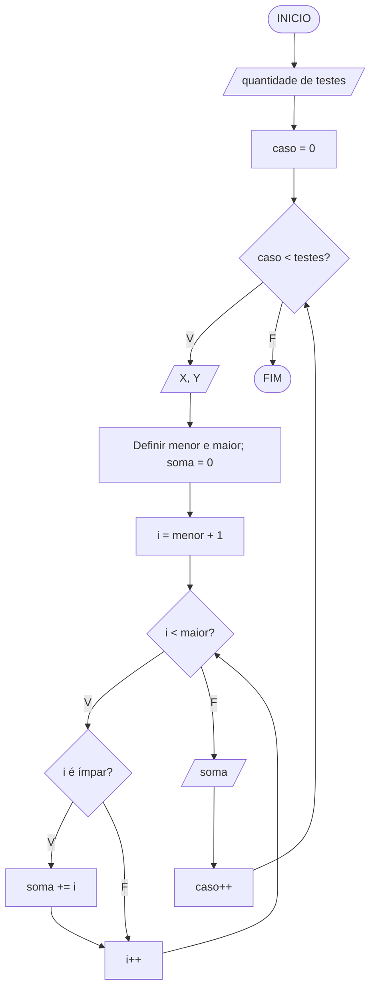

# BEE1099 - Soma de Ímpares Consecutivos II

## Fluxograma

```mermaid
flowchart TD
A([INICIO]) --> B[/"quantidade de testes"/]
B --> C["caso = 0"]
C --> D{"caso < testes?"}
D -- V --> E[/"X, Y"/]
E --> F["Definir menor e maior; soma = 0"]
F --> G["i = menor + 1"]
G --> H{"i < maior?"}
H -- V --> I{"i é ímpar?"}
I -- V --> J["soma += i"]
I -- F --> K["i++"]
J --> K
K --> H
H -- F --> L[/"soma"/]
L --> M["caso++"]
M --> D
D -- F --> N([FIM])
```
