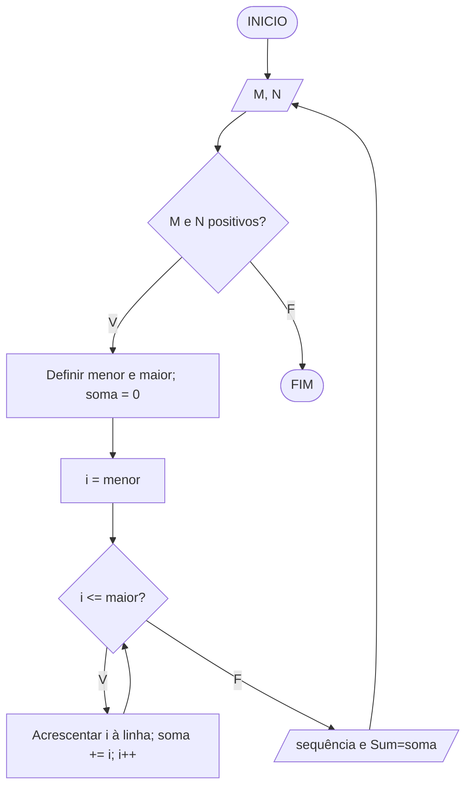

# BEE1101 - Sequência de Números e Soma

## Fluxograma

```mermaid
flowchart TD
A([INICIO]) --> B[/"M, N"/]
B --> C{"M e N positivos?"}
C -- V --> D["Definir menor e maior; soma = 0"]
D --> E["i = menor"]
E --> F{"i <= maior?"}
F -- V --> G["Acrescentar i à linha; soma += i; i++"]
G --> F
F -- F --> H[/"sequência e Sum=soma"/]
H --> B
C -- F --> I([FIM])
```
