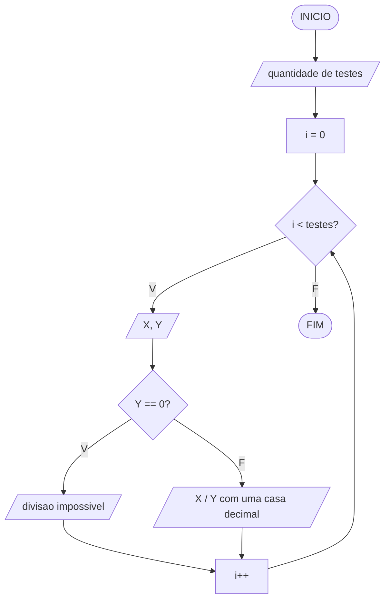

# BEE1116 - Dividindo X por Y

## Fluxograma

```mermaid
flowchart TD
A([INICIO]) --> B[/"quantidade de testes"/]
B --> C["i = 0"]
C --> D{"i < testes?"}
D -- V --> E[/"X, Y"/]
E --> F{"Y == 0?"}
F -- V --> G[/"divisao impossivel"/]
F -- F --> H[/"X / Y com uma casa decimal"/]
G --> I["i++"]
H --> I
I --> D
D -- F --> J([FIM])
```
