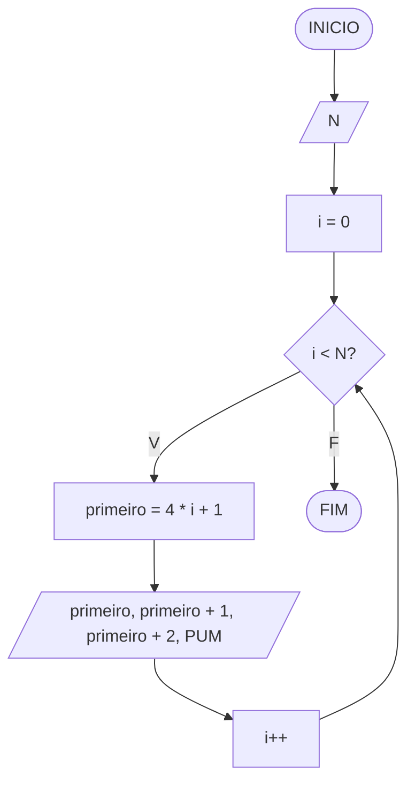

# BEE1142 - PUM

## Fluxograma

```mermaid
flowchart TD
A([INICIO]) --> B[/"N"/]
B --> C["i = 0"]
C --> D{"i < N?"}
D -- V --> E["primeiro = 4 * i + 1"]
E --> F[/"primeiro, primeiro + 1, primeiro + 2, PUM"/]
F --> G["i++"]
G --> D
D -- F --> H([FIM])
```
