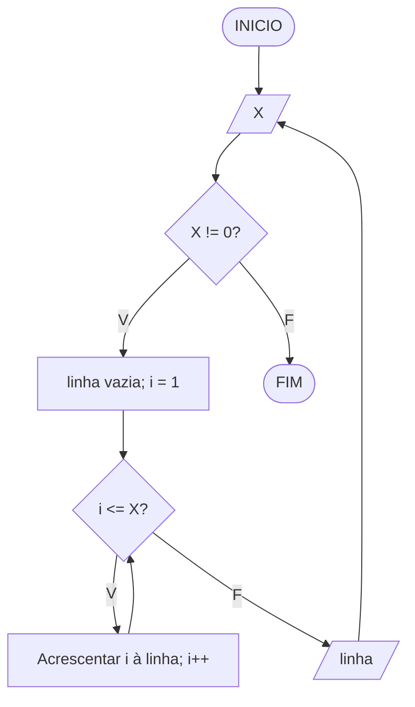

# BEE1146 - Sequências Crescentes

## Fluxograma

```mermaid
flowchart TD
A([INICIO]) --> B[/"X"/]
B --> C{"X != 0?"}
C -- V --> D["linha vazia; i = 1"]
D --> E{"i <= X?"}
E -- V --> F["Acrescentar i à linha; i++"]
F --> E
E -- F --> G[/"linha"/]
G --> B
C -- F --> H([FIM])
```
