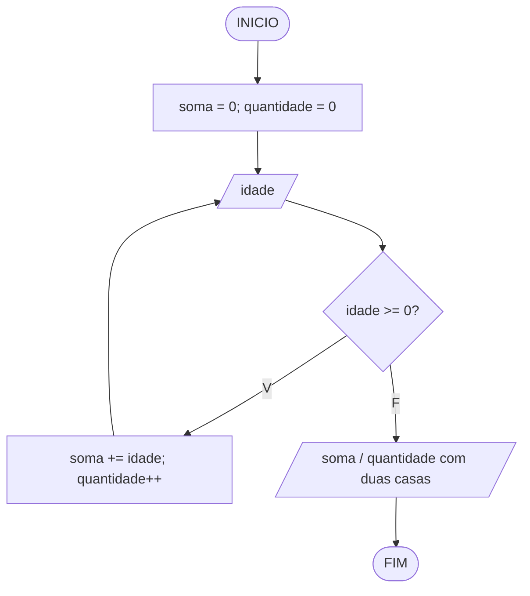

# BEE1154 - Idades

## Fluxograma

```mermaid
flowchart TD
A([INICIO]) --> B["soma = 0; quantidade = 0"]
B --> C[/"idade"/]
C --> D{"idade >= 0?"}
D -- V --> E["soma += idade; quantidade++"]
E --> C
D -- F --> F[/"soma / quantidade com duas casas"/]
F --> G([FIM])
```
