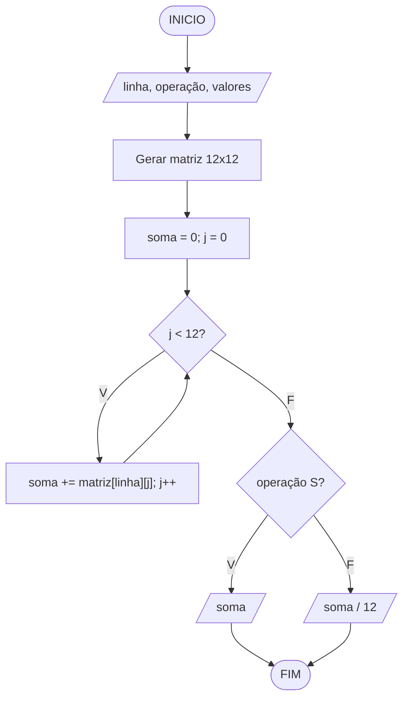

# BEE1181 - Linha na Matriz

Solução didática da [Aula 11](../aulas/aula11/exs_aula11.md): os 144 valores são lidos em uma entrada e organizados em uma matriz 12x12.

## Fluxograma

```mermaid
flowchart TD
A([INICIO]) --> B[/"linha, operação, valores"/]
B --> C["Gerar matriz 12x12"]
C --> D["soma = 0; j = 0"]
D --> E{"j < 12?"}
E -- V --> F["soma += matriz[linha][j]; j++"]
F --> E
E -- F --> G{"operação S?"}
G -- V --> H[/"soma"/]
G -- F --> I[/"soma / 12"/]
H --> J([FIM])
I --> J
```
