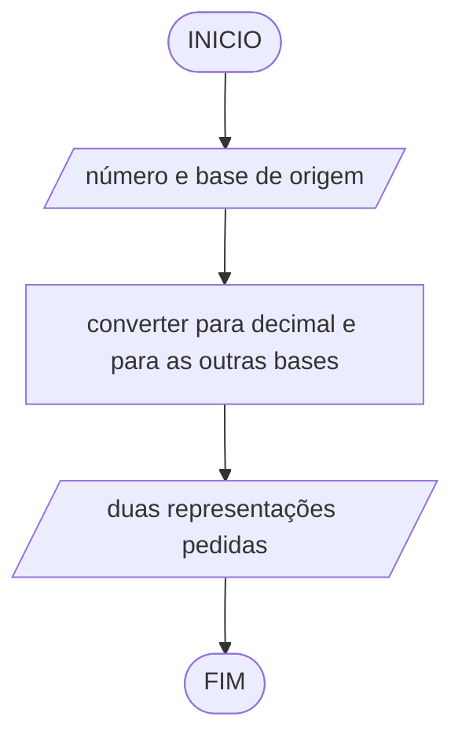

# BEE1193 - Conversão entre Bases

## Fluxograma

```mermaid
flowchart TD
A([INICIO]) --> B[/"número e base de origem"/]
B --> C["converter para decimal e para as outras bases"]
C --> D[/"duas representações pedidas"/]
D --> E([FIM])
```
