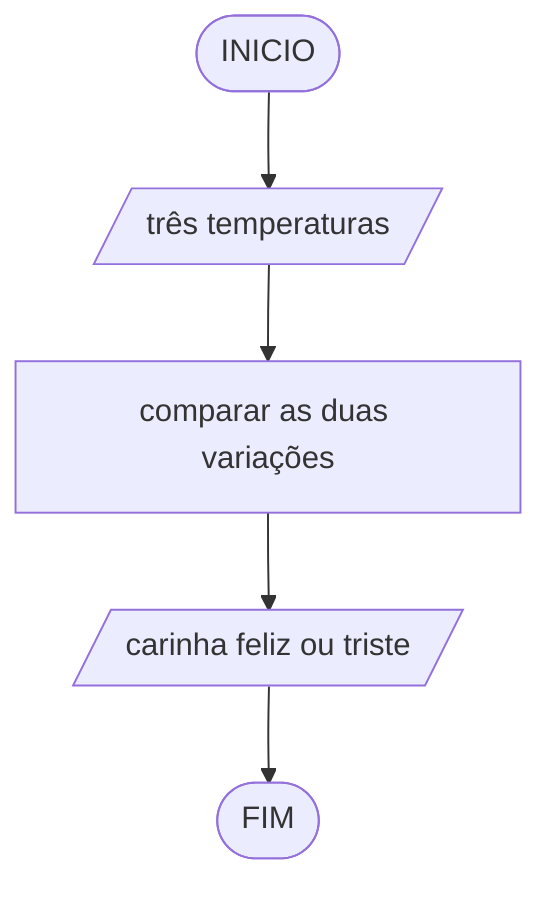

# BEE1847 - Bem-vindos e Bem-vindas ao Inverno!

## Fluxograma

```mermaid
flowchart TD
A([INICIO]) --> B[/"três temperaturas"/]
B --> C["comparar as duas variações"]
C --> D[/"carinha feliz ou triste"/]
D --> E([FIM])
```
