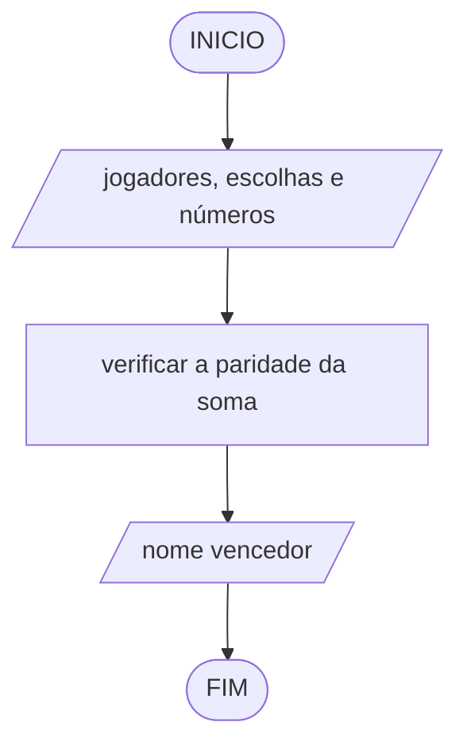

# BEE1914 - De Quem é a Vez?

## Fluxograma

```mermaid
flowchart TD
A([INICIO]) --> B[/"jogadores, escolhas e números"/]
B --> C["verificar a paridade da soma"]
C --> D[/"nome vencedor"/]
D --> E([FIM])
```
