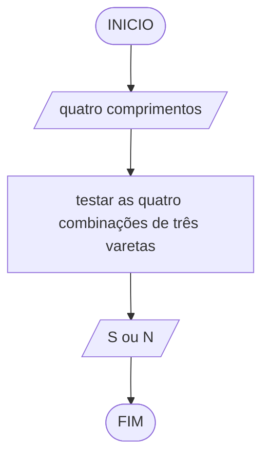

# BEE1929 - Triângulo

## Fluxograma

```mermaid
flowchart TD
A([INICIO]) --> B[/"quatro comprimentos"/]
B --> C["testar as quatro combinações de três varetas"]
C --> D[/"S ou N"/]
D --> E([FIM])
```
