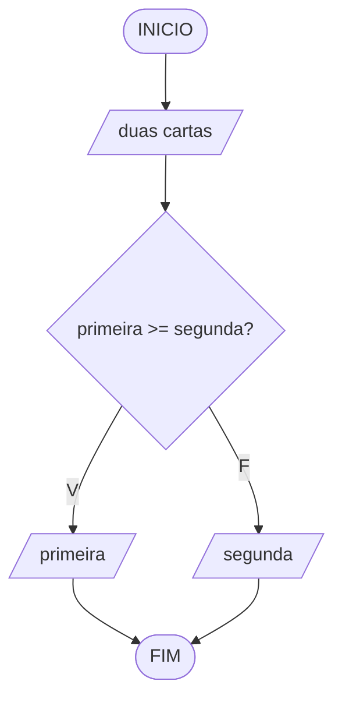

# BEE1933 - Tri-du

## Fluxograma

```mermaid
flowchart TD
A([INICIO]) --> B[/"duas cartas"/]
B --> C{"primeira >= segunda?"}
C -- V --> D[/"primeira"/]
C -- F --> E[/"segunda"/]
D --> F([FIM])
E --> F
```
