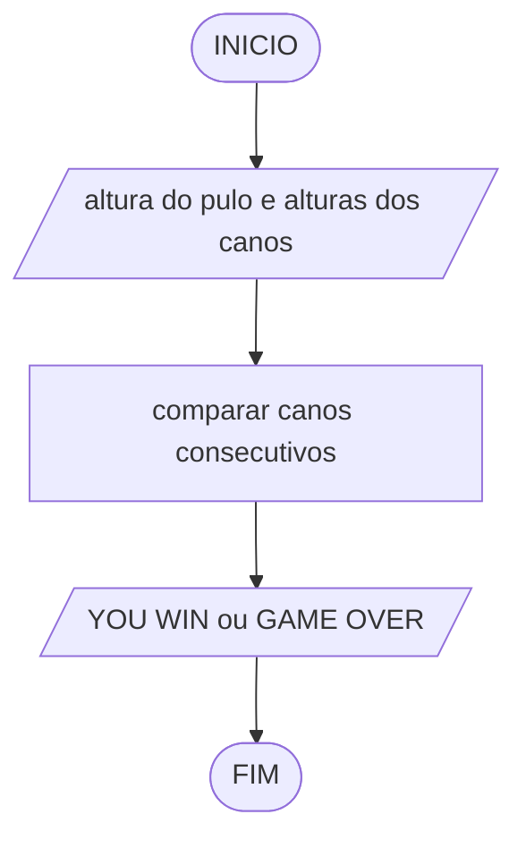

# BEE1961 - Pula Sapo

## Fluxograma

```mermaid
flowchart TD
A([INICIO]) --> B[/"altura do pulo e alturas dos canos"/]
B --> C["comparar canos consecutivos"]
C --> D[/"YOU WIN ou GAME OVER"/]
D --> E([FIM])
```
