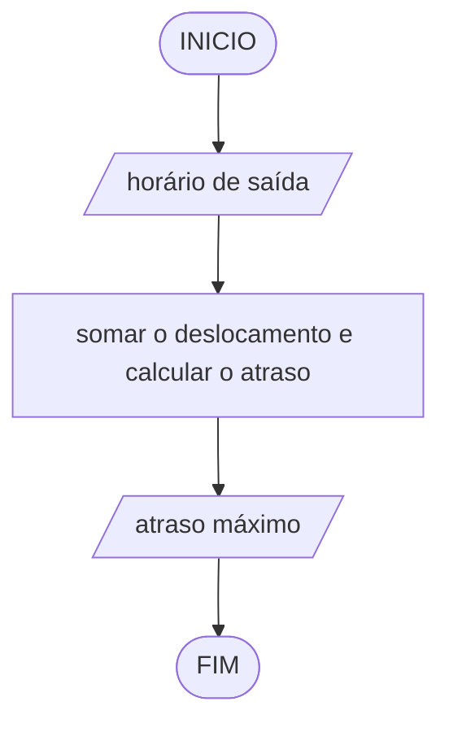

# BEE2003 - Domingo de Manhã

## Fluxograma

```mermaid
flowchart TD
A([INICIO]) --> B[/"horário de saída"/]
B --> C["somar o deslocamento e calcular o atraso"]
C --> D[/"atraso máximo"/]
D --> E([FIM])
```
