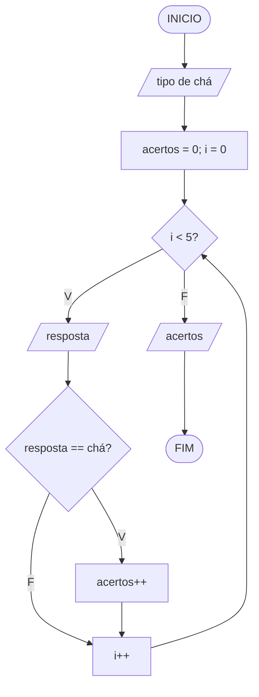

# BEE2006 - Identificando o Chá

## Fluxograma

```mermaid
flowchart TD
A([INICIO]) --> B[/"tipo de chá"/]
B --> C["acertos = 0; i = 0"]
C --> D{"i < 5?"}
D -- V --> E[/"resposta"/]
E --> F{"resposta == chá?"}
F -- V --> G["acertos++"]
F -- F --> H["i++"]
G --> H
H --> D
D -- F --> I[/"acertos"/]
I --> J([FIM])
```
