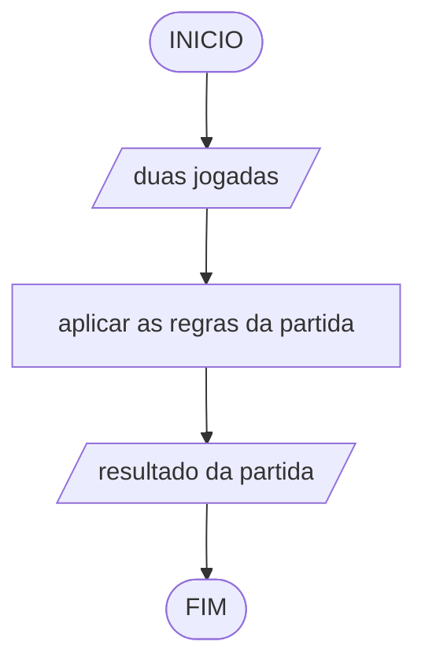

# BEE2031 - Pedra, Papel, Ataque Aéreo

## Fluxograma

```mermaid
flowchart TD
A([INICIO]) --> B[/"duas jogadas"/]
B --> C["aplicar as regras da partida"]
C --> D[/"resultado da partida"/]
D --> E([FIM])
```
