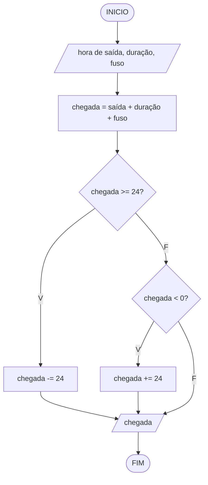

# BEE2057 - Fuso Horário

## Fluxograma

```mermaid
flowchart TD
A([INICIO]) --> B[/"hora de saída, duração, fuso"/]
B --> C["chegada = saída + duração + fuso"]
C --> D{"chegada >= 24?"}
D -- V --> E["chegada -= 24"]
D -- F --> F{"chegada < 0?"}
F -- V --> G["chegada += 24"]
F -- F --> H[/"chegada"/]
E --> H
G --> H
H --> I([FIM])
```
