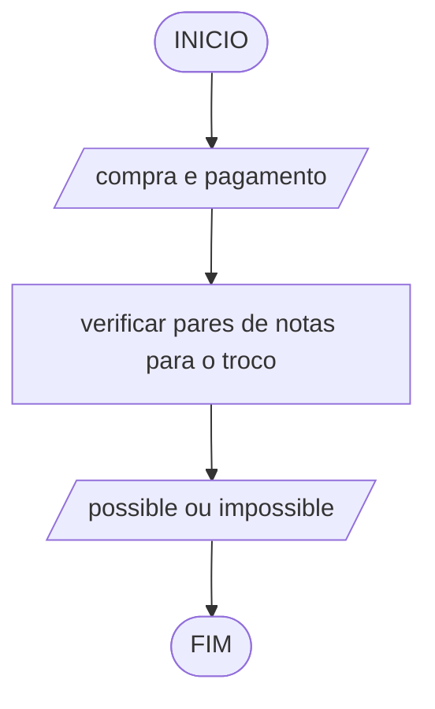

# BEE2140 - Duas Notas

## Fluxograma

```mermaid
flowchart TD
A([INICIO]) --> B[/"compra e pagamento"/]
B --> C["verificar pares de notas para o troco"]
C --> D[/"possible ou impossible"/]
D --> E([FIM])
```
