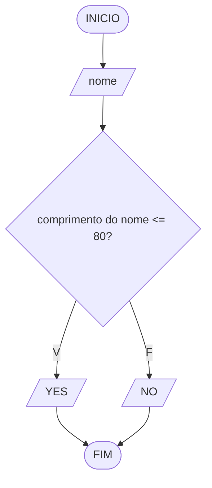

# BEE2160 - Nome no Formulário

## Fluxograma

```mermaid
flowchart TD
A([INICIO]) --> B[/"nome"/]
B --> C{"comprimento do nome <= 80?"}
C -- V --> D[/"YES"/]
C -- F --> E[/"NO"/]
D --> F([FIM])
E --> F
```
