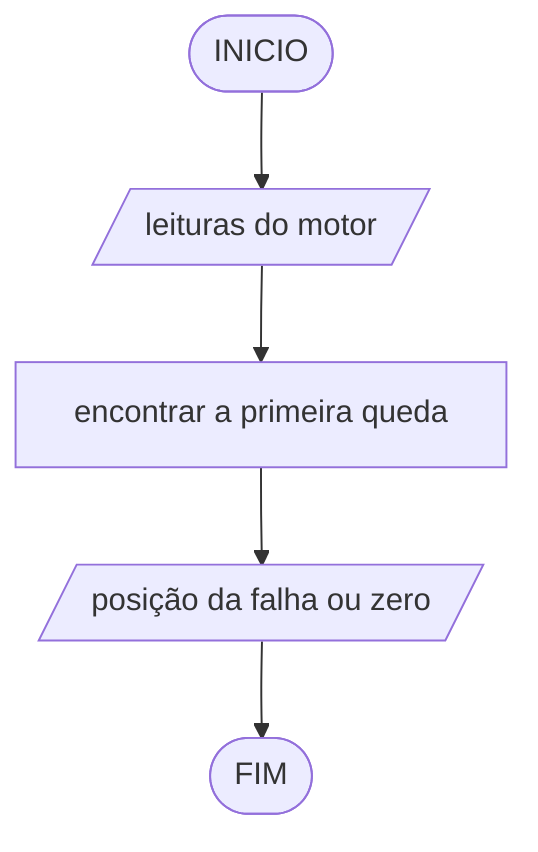

# BEE2167 - Falha do Motor

## Fluxograma

```mermaid
flowchart TD
A([INICIO]) --> B[/"leituras do motor"/]
B --> C["encontrar a primeira queda"]
C --> D[/"posição da falha ou zero"/]
D --> E([FIM])
```
