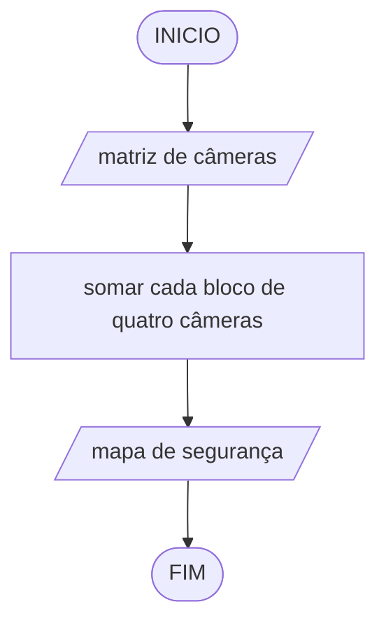

# BEE2168 - Crepúsculo em Portland

## Fluxograma

```mermaid
flowchart TD
A([INICIO]) --> B[/"matriz de câmeras"/]
B --> C["somar cada bloco de quatro câmeras"]
C --> D[/"mapa de segurança"/]
D --> E([FIM])
```
