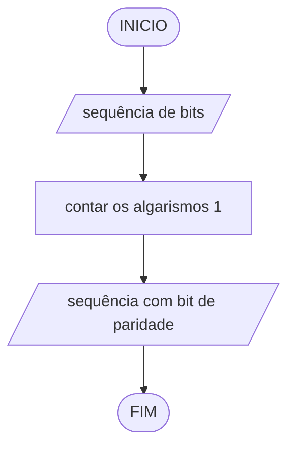

# BEE2176 - Paridade

## Fluxograma

```mermaid
flowchart TD
A([INICIO]) --> B[/"sequência de bits"/]
B --> C["contar os algarismos 1"]
C --> D[/"sequência com bit de paridade"/]
D --> E([FIM])
```
