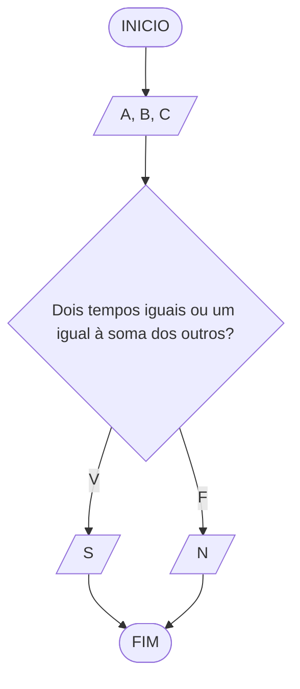

# BEE2235 - Andando no Tempo

## Fluxograma

```mermaid
flowchart TD
A([INICIO]) --> B[/"A, B, C"/]
B --> C{"Dois tempos iguais ou um igual à soma dos outros?"}
C -- V --> D[/"S"/]
C -- F --> E[/"N"/]
D --> F([FIM])
E --> F
```
