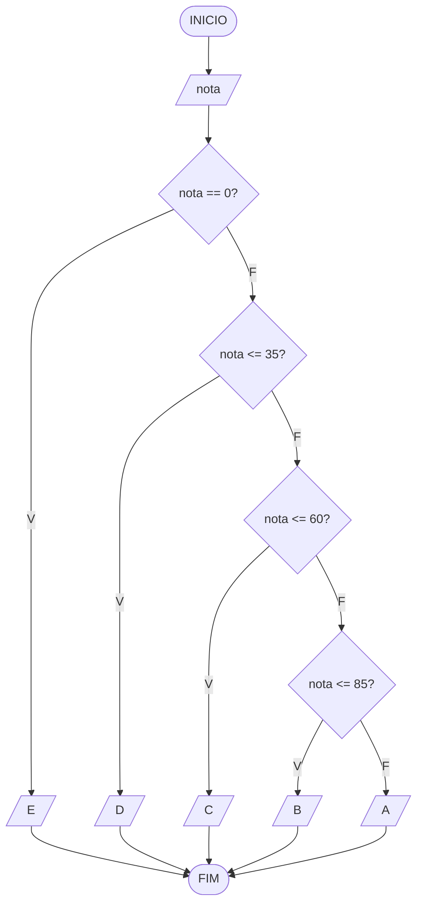

# BEE2344 - Notas da Prova

## Fluxograma

```mermaid
flowchart TD
A([INICIO]) --> B[/"nota"/]
B --> C{"nota == 0?"}
C -- V --> D[/"E"/]
C -- F --> E{"nota <= 35?"}
E -- V --> F[/"D"/]
E -- F --> G{"nota <= 60?"}
G -- V --> H[/"C"/]
G -- F --> I{"nota <= 85?"}
I -- V --> J[/"B"/]
I -- F --> K[/"A"/]
D --> L([FIM])
F --> L
H --> L
J --> L
K --> L
```
