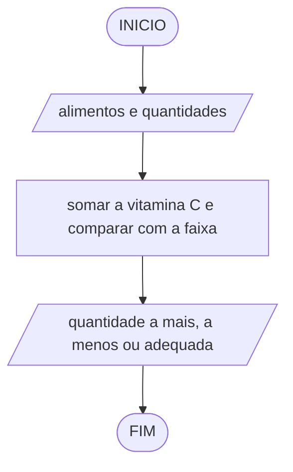

# BEE2486 - C Mais ou Menos?

## Fluxograma

```mermaid
flowchart TD
A([INICIO]) --> B[/"alimentos e quantidades"/]
B --> C["somar a vitamina C e comparar com a faixa"]
C --> D[/"quantidade a mais, a menos ou adequada"/]
D --> E([FIM])
```
