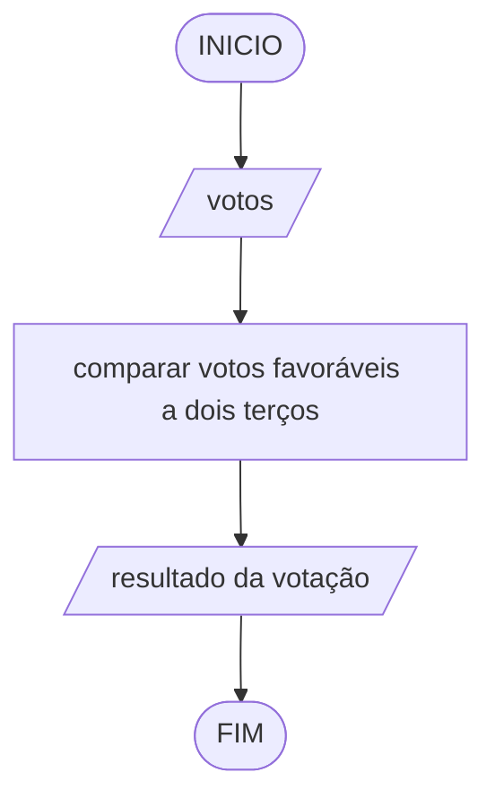

# BEE2540 - Impeachment do Líder

## Fluxograma

```mermaid
flowchart TD
A([INICIO]) --> B[/"votos"/]
B --> C["comparar votos favoráveis a dois terços"]
C --> D[/"resultado da votação"/]
D --> E([FIM])
```
