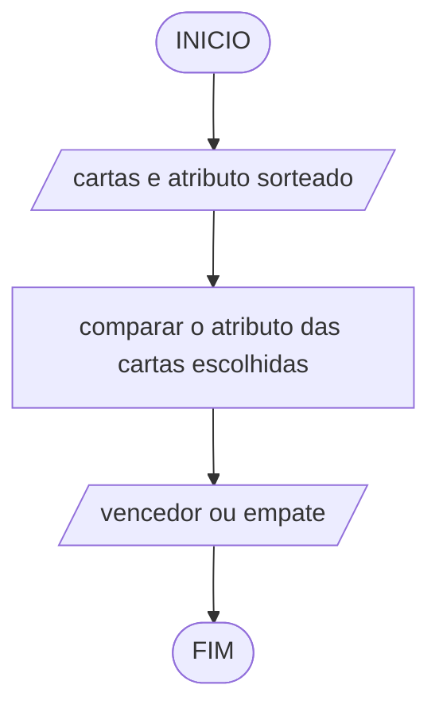

# BEE2542 - Iu-Di-Oh!

## Fluxograma

```mermaid
flowchart TD
A([INICIO]) --> B[/"cartas e atributo sorteado"/]
B --> C["comparar o atributo das cartas escolhidas"]
C --> D[/"vencedor ou empate"/]
D --> E([FIM])
```
