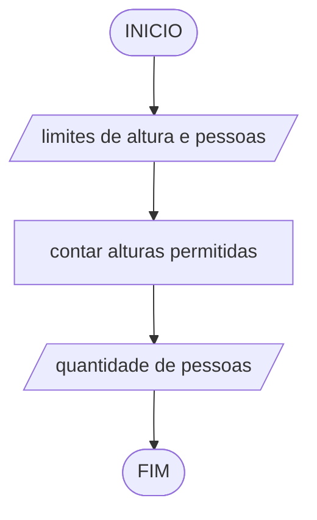

# BEE2547 - Montanha-Russa

## Fluxograma

```mermaid
flowchart TD
A([INICIO]) --> B[/"limites de altura e pessoas"/]
B --> C["contar alturas permitidas"]
C --> D[/"quantidade de pessoas"/]
D --> E([FIM])
```
