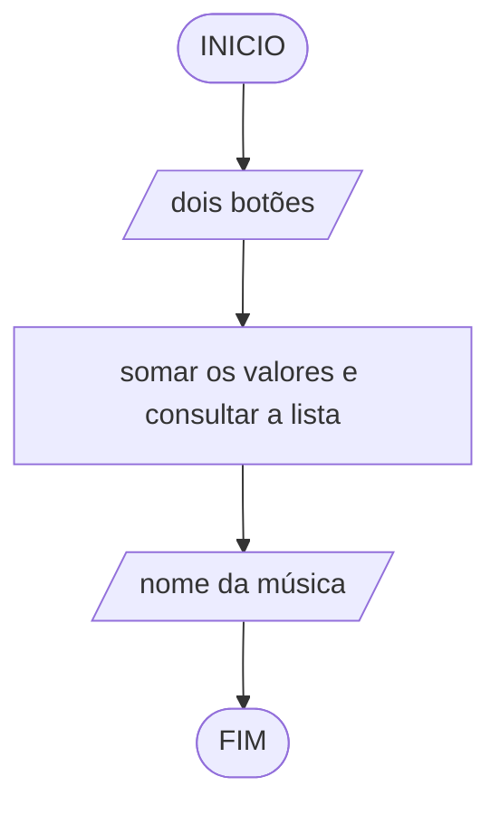

# BEE2582 - System of a Download

## Fluxograma

```mermaid
flowchart TD
A([INICIO]) --> B[/"dois botões"/]
B --> C["somar os valores e consultar a lista"]
C --> D[/"nome da música"/]
D --> E([FIM])
```
