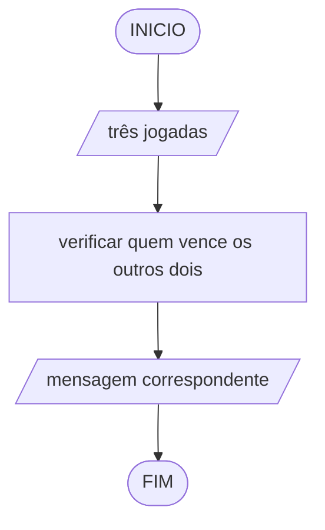

# BEE2626 - Turma do JB6

## Fluxograma

```mermaid
flowchart TD
A([INICIO]) --> B[/"três jogadas"/]
B --> C["verificar quem vence os outros dois"]
C --> D[/"mensagem correspondente"/]
D --> E([FIM])
```
