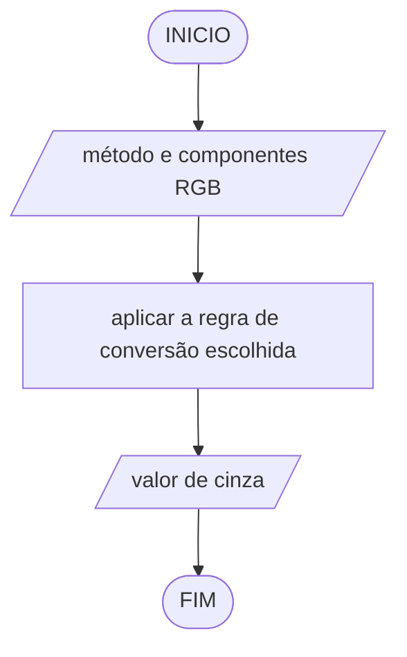

# BEE2630 - Escala de Cinza

## Fluxograma

```mermaid
flowchart TD
A([INICIO]) --> B[/"método e componentes RGB"/]
B --> C["aplicar a regra de conversão escolhida"]
C --> D[/"valor de cinza"/]
D --> E([FIM])
```
